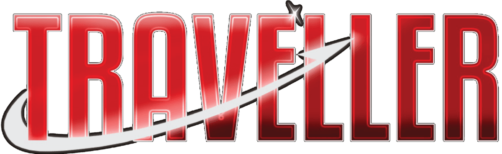

# Traveller RPG Encounter Planner

Welcome to the **Traveller RPG Encounter Planner**.

This project is built to help referees and players quickly estimate and plan the complexity of various combat encounters in the _Traveller_ roleplaying game.

Combat in Traveller is famously lethal. This tool aims to give you insight into how dangerous or difficult an encounter might be — whether it involves:

- Personal combat
- Vehicle skirmishes
- Ship-to-ship engagements

Understanding the threat level ahead of time can help balance a session or plan for appropriate consequences.

One of the challenges with Traveller are the various different rulesets from Classic Traveller to Mongoose 2nd Edition and the various Cepheus Engine version. Different combat mechanics will lead to different results. Currently my preferred ruleset is close to the **Cepheus Light** ruleset and so these combat rules are used initially in this project.
